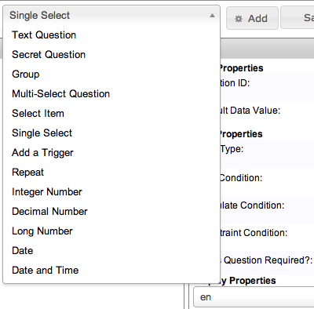
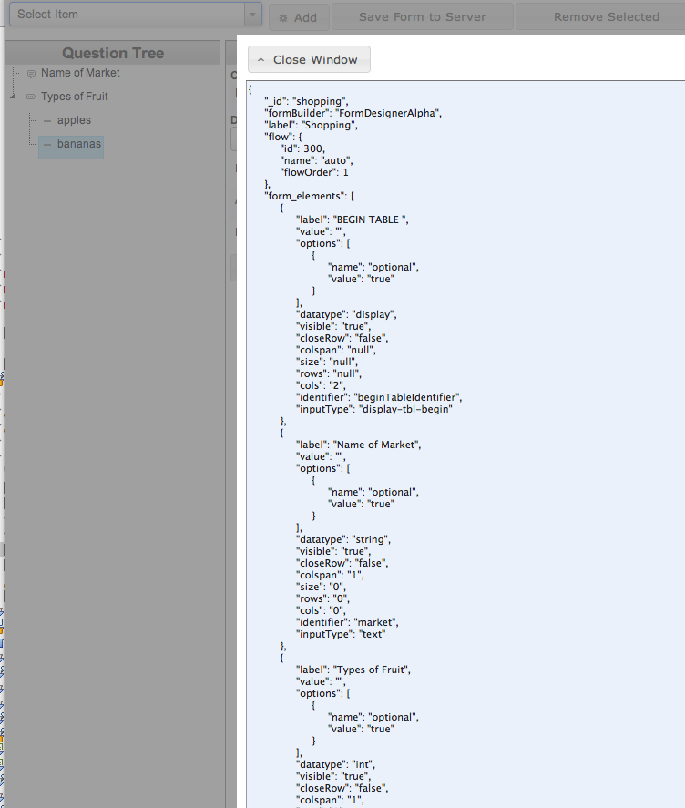

--- 
title: Form Designer
layout: default
category: none
---

#Form Designer

In the following screenshot, I have named the form "Shopping" and given it the id "shopping." 
In CouchDB, the document will be given the id "shopping," which you can use to reference in your code. 
The app currently does not check if there is a form already with that id.

The form currently has two fields, with id's market and types_of_fruit. 
Market is a text entry field, but we need to supply a Data Type for types_of_fruit, which is a Single Select (dropdown). Select Int.

To add enumerations (items) to the dropdown, select "Select Item" from the top left dropdown.

Enter a value and display label for the item. 

When you have completed the form, press "Save form to the server." 
It will display the JSON for the form and post the data to the CouchDB instance. 

[Generated JSON](form_example_json.txt) is available.

Click the Home button at the top right of the screen to return to the home page.

To confirm that your form is in the Couch, click the Form Designer icon beneath the bottom chart (last icon, looks like a gear.)
Click Databases and choose the Coconut database. In the Views section, click All Documents. Choose "Shopping" and view the JSON. 

