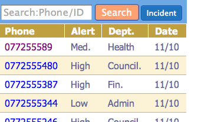
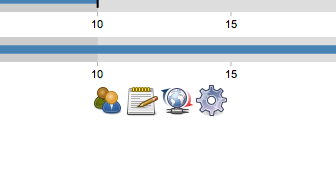

--- 
title: Using Coconut
layout: default
category: none
---

# Using Coconut

Coconut is designed to facilitate data entry and monitoring the progress of data entry. 
The coconut application displays the record listing on the left side of the screen and the charts on the right. 
 

## Record Listing

The record listing has the following features:
* Search
* Link to new Incident form
* Record listing, with links to record.

&nbsp;

&nbsp;

## Administration

Buttons beneath the charts link to administrative features of the application:
* Populate database - generates 100 records in the database. Does not work if there are already records in the database.
* Form designer
* Refresh page - useful when there is a page error.
* Mobile Futon - manipulate the CouchDB

